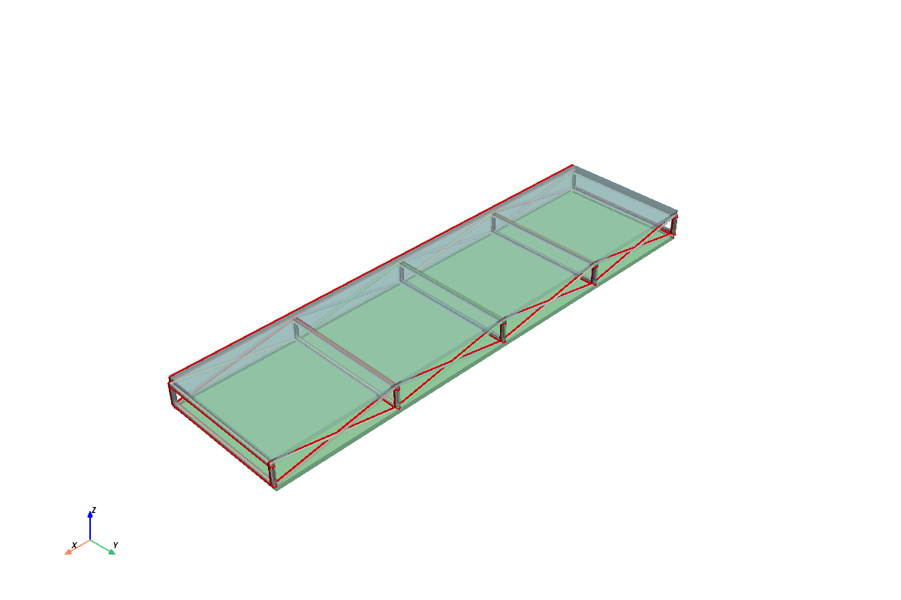

# RapidCAD-Py

A Python library for parametric CAD modeling with built-in FEA and 3D visualization. Integrates with Autodesk Inventor and OpenCASCADE.


## 🚀 Features

- **Fluent API** for intuitive CAD modeling
- **Finite Element Analysis** powered by torch-fem
- **3D Visualization** with PyVista
- **CAD Integration** with Autodesk Inventor and OpenCASCADE
- **Export** to STEP, STL, and native CAD formats

## 📦 Installation

```bash
git clone https://github.com/rapidcad/rapidcadpy.git
cd rapidcadpy
pip install -e .          # Basic install
pip install -e ".[fea]"   # With FEA support
```

## 🏁 Quick Start

### Build a Model

```python
from rapidcadpy.integrations.occ import OpenCascadeApp

app = OpenCascadeApp()
wp = app.work_plane("XY")

# Create a box with a hole
box = wp.rect(30, 30, centered=True).extrude(10)
hole = wp.circle(5).extrude(15)
result = box.cut(hole)

# Visualize
app.show_3d(camera_angle="iso", screenshot="model.png")
```



### Run FEA Analysis

```python
from rapidcadpy.integrations.occ import OpenCascadeApp
from rapidcadpy.fea import Material, FixedConstraint, DistributedLoad

app = OpenCascadeApp()
beam = app.work_plane("XY").rect(10, 100).extrude(10)

results = app.fea(
    material=Material.STEEL,
    mesh_size=2.0,
    constraints=[FixedConstraint(location="x_min")],
    loads=[DistributedLoad(location="z_max", force=-1000.0, direction="z")],
)

print(results.summary())
results.show(display='displacement')
```


### Export Models

```python
result.export("model.step")  # STEP format
result.export("model.stl")   # STL format
result.export("model.ipt")   # Autodesk Inventor (Windows)
```

## 📚 Documentation

```bash
cd docs && npm install && npm run dev
```

Open http://localhost:3000/docs

## 🧪 Testing

```bash
pytest tests/
```
