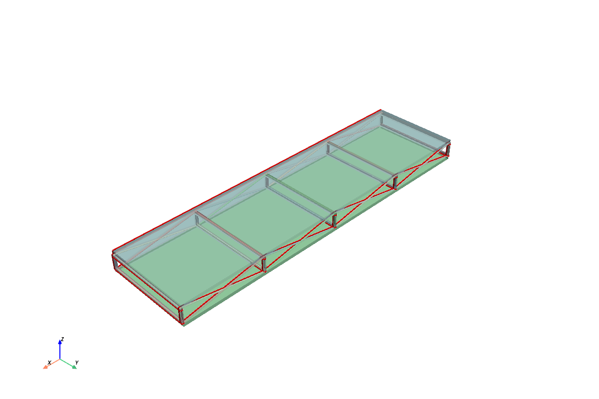
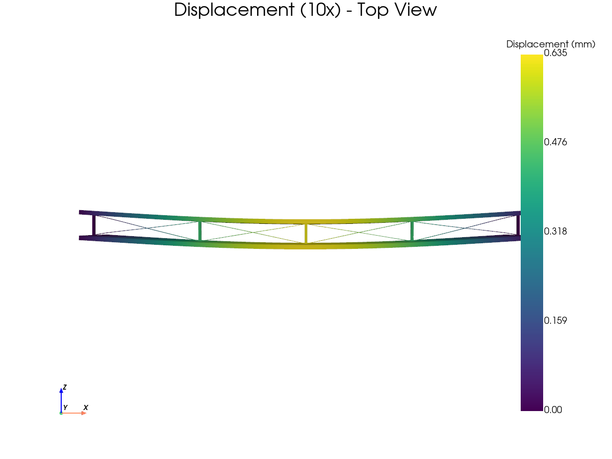

# RapidCAD-Py

A Python library for parametric CAD modeling with built-in FEA and 3D visualization. Integrates with Autodesk Inventor and OpenCASCADE.


## 🚀 Features

- **Fluent API** for intuitive CAD modeling
- **Finite Element Analysis** powered by torch-fem
- **3D Visualization** with PyVista
- **CAD Integration** with Autodesk Inventor and OpenCASCADE
- **Export** to STEP, STL, and native CAD formats

## 📦 Installation

```bash
git clone https://github.com/rapidcad/rapidcadpy.git
cd rapidcadpy
pip install -e .          # Basic install
pip install -e ".[fea]"   # With FEA support
```

# Documentation

[](https://rapidcadpy-yk28.vercel.app)

## 🏁 Quick Start

### Build a Model

```python
from rapidcadpy.integrations.occ import OpenCascadeApp

app = OpenCascadeApp()
wp = app.work_plane("XY")

# Create a box with a hole
box = wp.rect(30, 30, centered=True).extrude(10)
hole = wp.circle(5).extrude(15)
result = box.cut(hole)

# Visualize
app.show_3d(camera_angle="iso", screenshot="model.png")
```



### Run FEA Analysis

```python
from rapidcadpy.integrations.occ import OpenCascadeApp
from rapidcadpy.fea import Material, FixedConstraint, DistributedLoad

app = OpenCascadeApp()
beam = app.work_plane("XY").rect(10, 100).extrude(10)

results = app.fea(
    material=Material.STEEL,
    mesh_size=2.0,
    constraints=[FixedConstraint(location="x_min")],
    loads=[DistributedLoad(location="z_max", force=-1000.0, direction="z")],
)

print(results.summary())
results.show(display='displacement')
```



### Export Models

```python
result.export("model.step")  # STEP format
result.export("model.stl")   # STL format
result.export("model.ipt")   # Autodesk Inventor (Windows)
```

## 📚 Documentation

```bash
cd docs && npm install && npm run dev
```

Open http://localhost:3000/docs

## � MCP Server (Docs via Model Context Protocol)

The `mcp/` directory contains a [FastMCP](https://github.com/jlowin/fastmcp) server
that exposes all RapidCAD.py documentation as MCP resources and tools, making it
directly accessible to AI assistants (Claude, GitHub Copilot, etc.).

### Run via FastMCP CLI

```bash
fastmcp run mcp/server.py
# HTTP/SSE transport:
fastmcp run mcp/server.py --transport sse --port 8765
```

### Add to Claude Desktop / VS Code Copilot

**Option A – let the client launch the process (stdio):**

```json
{
  "mcpServers": {
    "rapidcadpy-docs": {
      "command": "python",
      "args": ["path/to/rapidcadpy/mcp/server.py"]
    }
  }
}
```

**Option B – connect to an already-running local SSE server on port 8765:**

First start the server:
```bash
fastmcp run mcp/server.py --transport sse --port 8765
```

Then point your client at it:

*Claude Desktop* (`claude_desktop_config.json`):
```json
{
  "mcpServers": {
    "rapidcadpy-docs": {
      "url": "http://localhost:8765/sse"
    }
  }
}
```

*VS Code Copilot* (`settings.json`):
```json
{
  "mcp": {
    "servers": {
      "rapidcadpy-docs": {
        "type": "sse",
        "url": "http://localhost:8765/sse"
      }
    }
  }
}
```

### Available tools

| Tool | Description |
|---|---|
| `list_docs` | List all documentation pages (path, title, section) |
| `get_doc(path)` | Full content of a page, e.g. `"finite-element-analysis/fea-analysis"` |
| `search_docs(query)` | Full-text search with snippets |
| `get_doc_section(section)` | All pages in a section (`computer-aided-design`, `finite-element-analysis`, `advanced`, `api`) |

Resource `docs://index` returns the top-level index page.

## �🧪 Testing

```bash
pytest tests/
```
