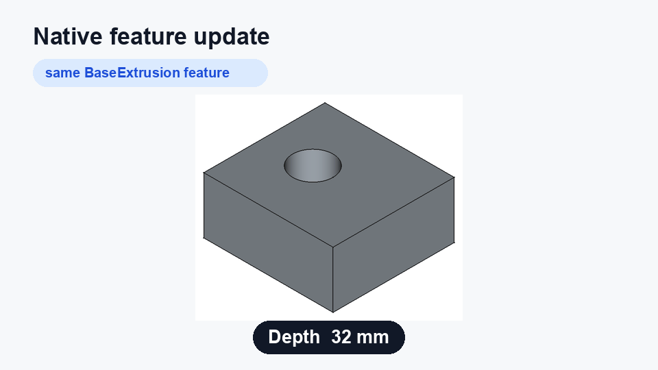

# RapidCADPy

[](https://github.com/rapidcad/rapidcadpy/actions/workflows/ci.yml)
[](./pyproject.toml)
[](./LICENSE)
[](https://docs.rapidcad.ai)
[](./pyproject.toml)

**One backend-neutral Python API for building, inspecting, and safely updating CAD models while preserving native feature history when the CAD system supports it.**

<p align="center">
  
</p>

<p align="center"><sub>A parameter edit recomputes the dependent cut while retaining the same native FreeCAD feature.</sub></p>

**[Architecture](./docs/architecture.md)** · **[Examples](./examples)** · **[Backend support](#backend-support)** · **[Contributing](./docs/contributing.md)** · **[Documentation](https://docs.rapidcad.ai)**

## 30-second quickstart

```bash
git clone https://github.com/rapidcad/rapidcadpy.git
cd rapidcadpy
uv sync --extra ocp
uv run python examples/quickstart.py
```

This writes `quickstart.step` from a modeled plate with a through-hole. FreeCAD
is discovered from an existing installation; other optional features are
installed with the `drawing`, `fea`, `importers`, `inventor`, or `visualization`
extras.

## Architecture

RapidCADPy separates modeling intent from CAD execution:

- Backend-neutral contracts keep modeling code portable across CAD systems.
- Document hydration maps native objects to stable RapidCAD IDs without
  serializing native handles.
- Expected revisions, recompute validation, and rollback protect native
  mutations from stale writes and partial updates.

## Backend support

| Capability | FreeCAD | OCP | Inventor |
|---|---:|---:|---:|
| Parametric sketches | ✅ | Partial | ✅ |
| Native feature history | ✅ | N/A | ✅ |
| Document hydration | ✅ | N/A | Planned |
| Revision-safe mutations | ✅ | Partial | Planned |
| STEP/STL export | ✅ | ✅ | ✅ |
| FEA | ✅ | ✅ | Partial |

`✅` is covered by backend or contract tests. `Partial` means a narrower API or
test surface; `Planned` is not exposed as supported behavior. OCP is a direct
geometry kernel, so desktop-document hydration and native feature history do
not apply.

## Tests

The green default suite needs no desktop CAD installation:

```bash
uv run pytest
```

Optional suites are selected explicitly with `--test-group ocp`, `freecad`,
`inventor`, or `fea`; repeat the option to combine groups.

RapidCADPy is alpha software released under the [MIT License](./LICENSE).
