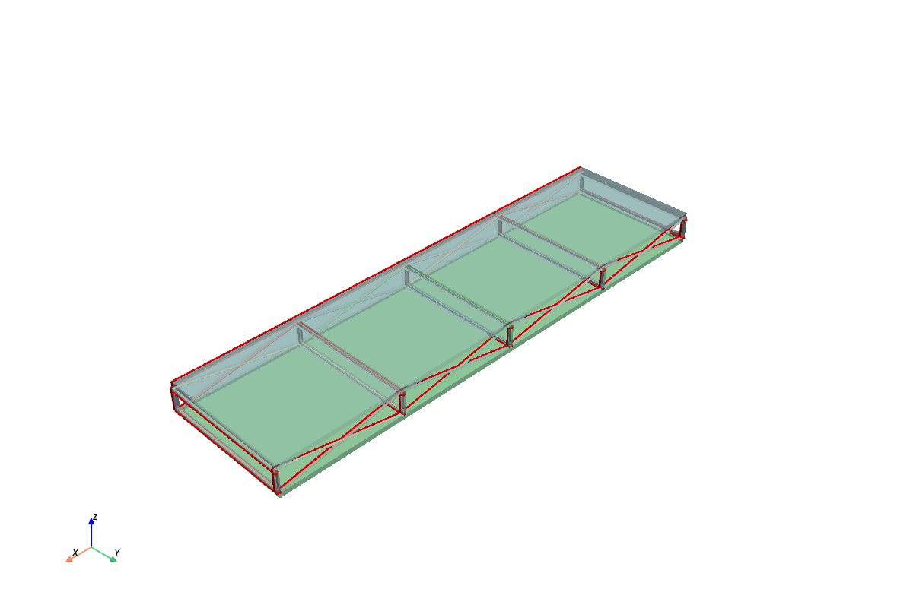
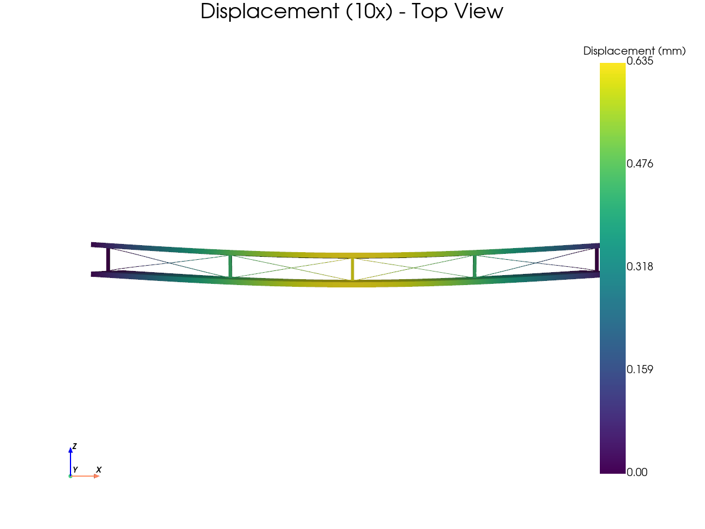

# RapidCAD-Py

A Python library for parametric CAD modeling with built-in FEA and 3D visualization. Integrates with FreeCAD, Autodesk Inventor, and OpenCascade.


## 🚀 Features

- **Fluent API** for intuitive CAD modeling
- **Finite Element Analysis** powered by torch-fem
- **3D Visualization** with PyVista
- **CAD Integration** with FreeCAD, Autodesk Inventor, and OpenCascade
- **Export** to STEP, STL, and native CAD formats

## 📦 Installation

```bash
git clone https://github.com/rapidcad/rapidcadpy.git
cd rapidcadpy
uv sync
```

Install only the capabilities you need. For example, the OpenCascade quick
start below also uses the visualization dependencies:

```bash
uv sync --extra ocp --extra visualization
```

Other supported extras are `drawing`, `fea`, `importers`, and `inventor`.
FreeCAD is discovered from an existing FreeCAD installation and is not
installed from PyPI.

# Documentation

[](https://docs.rapidcad.ai)

## 🏁 Quick Start

### Build a Model

```python
from rapidcadpy import OpenCascadeOcpApp

app = OpenCascadeOcpApp()

# Create a box with a hole
box = app.work_plane("XY").rect(30, 30, centered=True).close().extrude(10)
hole = app.work_plane("XY").circle(5).close().extrude(15)
result = box.cut(hole)

# Visualize
app.show_3d(camera_angle="iso", screenshot="model.png")
```



### Run FEA Analysis

```python
from rapidcadpy import OpenCascadeOcpApp
from rapidcadpy.fea import Material, FixedConstraint, DistributedLoad

app = OpenCascadeOcpApp()
beam = app.work_plane("XY").rect(10, 100).close().extrude(10)

results = app.fea(
    material=Material.STEEL,
    mesh_size=2.0,
    constraints=[FixedConstraint(location="x_min")],
    loads=[DistributedLoad(location="z_max", force=-1000.0, direction="z")],
)

print(results.summary())
results.show(display='displacement')
```



### Export Models

```python
result.export("model.step")  # STEP format
result.export("model.stl")   # STL format
```

## 📚 Documentation

```bash
cd docs && npm install && npm run dev
```

Open http://localhost:3000/docs

## 🧪 Testing

The core contract suite runs without an installed desktop CAD application:

```bash
uv run pytest
```

Tests are split into `core`, `ocp`, `freecad`, `inventor`, and `fea` groups.
The default is `core`; select another group explicitly after installing its
extra or native CAD runtime:

```bash
uv sync --extra ocp --extra visualization
uv run pytest --test-group ocp
uv run pytest --test-group freecad
uv run pytest --test-group inventor
uv run pytest --test-group fea
```

Repeat `--test-group` to combine groups, or use `--test-group all` in an
environment that provides every optional dependency and CAD application.
