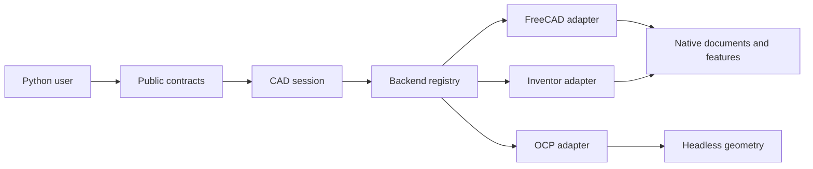

# Architecture

RapidCADPy provides one Python model for CAD systems with very different
runtime behavior. Desktop applications own documents, feature trees, GUI state,
and process-local objects. OCP builds geometry headlessly in the Python process.
The library keeps those differences behind public contracts so application code
does not branch on a CAD product for every operation.

## System shape

The diagram shows responsibility and dependency direction. The registry is the
architectural boundary for selecting a compatible backend family. The current
live-session path supports FreeCAD; OCP and Inventor enter through their direct
adapters while they migrate to that shared selection path.

| Layer | Responsibility | Main modules |
|---|---|---|
| Public contracts | Serializable modeling intent and backend-neutral references | [`cad_objects.py`](../rapidcadpy/cad_objects.py) |
| CAD session | Application selection, runtime state, hydration, and operation orchestration | [`cad_session.py`](../rapidcadpy/cad_session.py) |
| Backend selection | Discovery and construction of a compatible adapter family | [`cad_session.py`](../rapidcadpy/cad_session.py), [`integrations/`](../rapidcadpy/integrations) |
| Integrations | Native translation, transactions, validation, and export | [`integrations/`](../rapidcadpy/integrations) |
| Artifact services | Drawing, meshing, FEA, and explicit file outputs | [`drawing.py`](../rapidcadpy/drawing.py), [`fea/`](../rapidcadpy/fea) |

## Runtime state and public state

`CadSession` owns the selected application, document revision, stable RapidCAD
IDs, and the runtime lookup from those IDs to live objects. A `CadDocument` or
`CadObject` can hold a native handle internally so an adapter can read or mutate
the real document. Its `to_dict()` representation contains only JSON-safe
identity, properties, topology summaries, dependencies, and capabilities.

Hydration rebuilds the public view from the native document. It keeps the
one-to-one mapping between a native name and a RapidCAD ID, calculates a
document revision, and refreshes dependency and geometry metadata. Rehydrating
after a mutation prevents the Python mirror from claiming state the CAD system
did not accept.

## Read and mutation flows

A live read follows this path:

1. Discover applications without importing a CAD kernel.
2. Select a target and create its connection, modeling, hydration, and
   capability services as one compatible backend family.
3. Hydrate the active native document.
4. Keep native handles in runtime state and return only serialized public
   references.

A live mutation follows an optimistic-concurrency transaction:

1. Refresh the document and compare the caller's expected revision with the
   current revision.
2. Validate the request and inspect operation-level support.
3. Begin a native transaction and apply the backend operation.
4. Recompute and validate the native feature tree.
5. Rehydrate the document and calculate created, changed, and removed IDs.
6. Serialize the result before committing, then return the new revision.

Any failure aborts the native transaction and restores the Python-owned session
snapshot. Unsupported native behavior is reported explicitly; it is not
silently replaced by baked geometry.

## Five design decisions

### 1. Native handles never cross the serialization boundary

FreeCAD and Inventor objects are tied to an application process and often
cannot be copied, pickled, or used after a document changes. RapidCADPy stores
them only in runtime objects marked `repr=False`. Public dictionaries use
stable IDs and JSON-safe data. This keeps IPC and API consumers independent of
COM, FreeCAD Python objects, and kernel ABI details.

### 2. Public references remain backend-neutral

Callers work with concepts such as `CadDocument`, `CadObject`, `CadFeature`,
`CadParameter`, `GeometrySelection`, and `CadOperationResult`. Adapters translate
those contracts to native names and properties. Adding a backend extends the
translation layer instead of adding product checks to user code.

### 3. Mutations require expected document revisions

Edits to an existing live document carry the revision observed by the caller.
A mismatch returns `document_revision_mismatch` before the write begins. This
prevents a delayed automation request from overwriting a user's newer GUI edit
and makes retry behavior explicit.

### 4. Native feature history is preserved

On a parametric backend, editing an extrusion, sketch, hole, fillet, loft, or
parameter updates the native feature or adds a native dependent feature. The
operation result reports its support mode and any warnings. Direct B-Rep edits
must be an explicit mode because they can discard editability and topology
identity.

### 5. GUI execution and artifact generation have separate lifecycles

Live adapters attach to an application the user can see. Closing a RapidCADPy
connection must not terminate that application, and successful edits remain
visible in its active document. Headless OCP modeling and isolated meshing or
solver processes instead own disposable geometry and produce explicit files.
Keeping these lifecycles separate avoids hidden GUI ownership, stale native
handles, and environment conflicts between CAD and solver runtimes.

## Extending a backend

A backend should provide discovery and connection behavior, modeling and
hydration services, capability inspection, and native adapters for document
operations. Register factories lazily so importing `rapidcadpy` does not import
optional CAD modules. Every mutation must report `supported`, `conditional`, or
`unsupported`, including its edit mode and reason.

The contract and boundary tests in [`tests/`](../tests) are the executable form
of these rules. Native integration tests add evidence for behavior that mocks
cannot prove, such as feature-tree preservation and application-specific
transactions.
