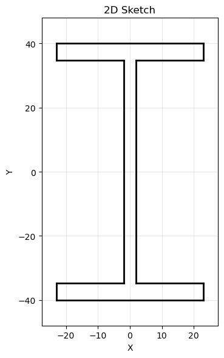
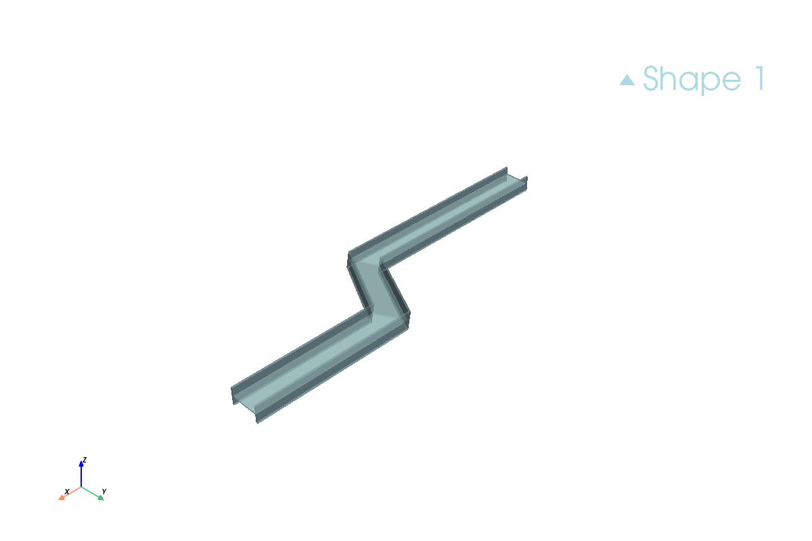

RapidCADPy ships with a small library of **preset 2D cross-sections** ("profiles").

These profiles are **parametric profile factories**: they sketch themselves onto a
workplane and return a normal sketch object. From there you can use the standard
CAD operations like `.extrude(...)` or `.sweep(...)`.

## Import

```python
from rapidcadpy.integrations.occ.app import OpenCascadeApp
from rapidcadpy.components import profiles
```

## Example: IPE80 profile

The image below shows the **IPE80** outline as a closed 2D sketch.



### Extrude a straight beam

```python
app = OpenCascadeApp()

wp = app.work_plane("XY")
profile = profiles.ipe("IPE80").sketch(wp)

beam = profile.extrude(300.0)
beam.to_step("ipe80_extrude.step")
app.show_3d(screenshot="ipe80_extrude.png")
```

### Sweep along a 3D polyline path

This uses the 3D sketch API as the **spine** (path) and sweeps the preset profile
along it.

```python
app = OpenCascadeApp()

# section/profile
wp = app.work_plane("XY")
profile = profiles.ipe("IPE80").sketch(wp)

# spine/path
spine = app.sketch_3d.move_to(0, 0, 0).polyline(
	[
		(0, 0, 0),
		(600, 0, 0),
		(800, 300, 100),
		(1200, 300, 100),
	]
)

solid = spine.sweep(profile, is_frenet=True, transition_mode="right")
solid.to_step("ipe80_sweep.step")
app.show_3d(screenshot="ipe80_sweep.png")
```



## Available profiles

You can inspect what's available at runtime:

```python
from rapidcadpy.components import profiles

print(profiles.list_profiles())
```

Currently implemented families:

- **IPE**: `IPE80`, `IPE100`, `IPE120`
- **IPN**: `IPN80`, `IPN100`, `IPN120`

