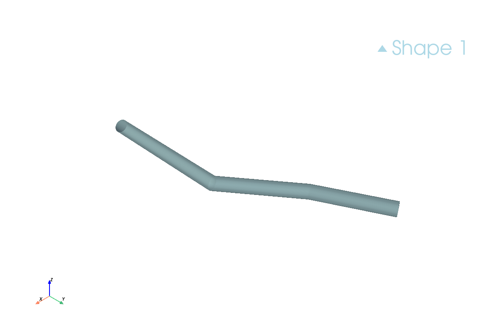
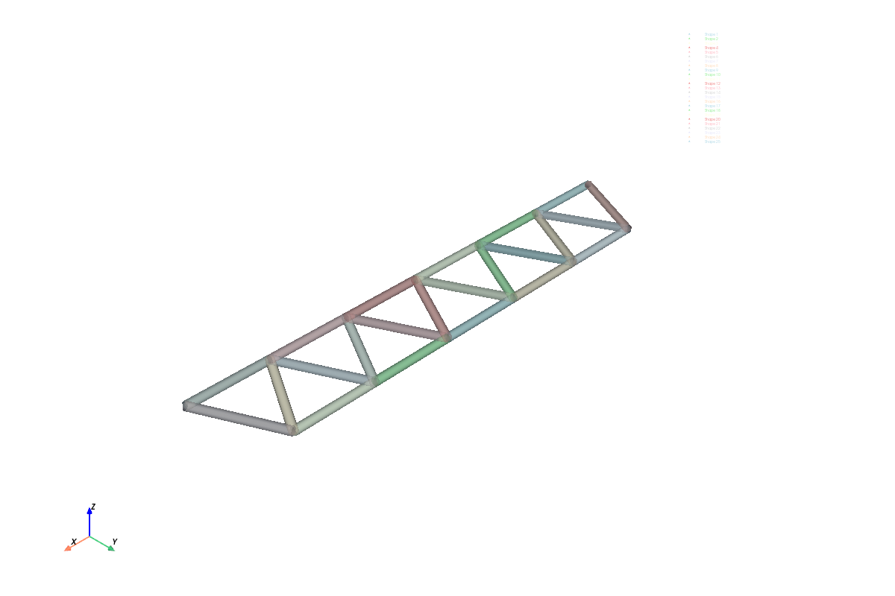

RapidCADPy supports two closely related operations:

- **Pipe**: sweep a *circular* profile along a path.
- **Sweep**: sweep an *arbitrary closed* profile along a path.

Both operations exist in two flavors:

1. **2D path** (a normal planar sketch): use `path_sketch.pipe(...)` or `path_sketch.sweep(profile_sketch)`
2. **3D path** (a spatial polyline): use `app.sketch_3d...pipe(...)` or `app.sketch_3d...sweep(profile_sketch)`

## Pipe (circular profile)

### Pipe along a 2D path

```python
from rapidcadpy.integrations.occ.app import OpenCascadeApp

app = OpenCascadeApp()
wp = app.work_plane("XY")

# Path is a 2D sketch (wire)
path = wp.move_to(0, 0).line_to(60, 0).line_to(80, 20).close()  # or any connected path

# Pipe sweeps a circle along the path
solid = path.pipe(
	diameter=10.0,
	is_frenet=True,
	transition_mode="right",  # "right" | "round" | "transformed"
)

solid.to_step("pipe_2d.step")
app.show_3d(screenshot="pipe_2d.png")
```

### Pipe along a 3D polyline

```python
from rapidcadpy.integrations.occ.app import OpenCascadeApp

app = OpenCascadeApp()

spine = app.sketch_3d.move_to(0, 0, 0).polyline(
	[
		(0, 0, 0),
		(300, 0, 0),
		(350, 50, 25),
		(500, 50, 25),
	]
)

solid = spine.pipe(
	diameter=20.0,
	is_frenet=True,
	transition_mode="right",
)

solid.to_step("pipe_3d.step")
app.show_3d(screenshot="pipe_3d.png")
```





## Sweep (arbitrary closed profile)

### Sweep a profile along a 2D path

Here the **path** is one sketch, and the **profile** is another sketch.

```python
from rapidcadpy.integrations.occ.app import OpenCascadeApp

app = OpenCascadeApp()

# Profile (cross-section)
wp_profile = app.work_plane("XY")
profile = wp_profile.rect(20, 10).close()

# Path (spine)
wp_path = app.work_plane("XY")
path = wp_path.move_to(0, 0).line_to(80, 0).line_to(120, 40).close()  # or open polyline path

solid = path.sweep(
	profile,
	make_solid=True,
	is_frenet=True,
	transition_mode="right",
)

solid.to_step("sweep_2d.step")
app.show_3d(screenshot="sweep_2d.png")
```

### Sweep a preset profile along a 3D polyline

This is the most common workflow for structural sections:

```python
from rapidcadpy.integrations.occ.app import OpenCascadeApp
from rapidcadpy.components import profiles

app = OpenCascadeApp()

# Profile
wp = app.work_plane("XY")
profile = profiles.ipe("IPE80").sketch(wp)

# Path
spine = app.sketch_3d.move_to(0, 0, 0).polyline(
	[
		(0, 0, 0),
		(600, 0, 0),
		(800, 300, 100),
		(1200, 300, 100),
	]
)

solid = spine.sweep(profile, is_frenet=True, transition_mode="right")
solid.to_step("ipe80_sweep.step")
app.show_3d(screenshot="ipe80_sweep.png")
```

## Parameters that matter

### `is_frenet`

- `True` (recommended): uses a Frenet/corrected moving frame so the profile stays more stable and perpendicular along the path.
- `False`: can produce twisting depending on geometry.

### `transition_mode`

Controls what happens at corners / $C^1$ discontinuities (e.g. polylines):

- `"right"`: sharp corner transition
- `"round"`: rounded transition
- `"transformed"`: transformed transition

If you see failures around corners, try switching the transition mode.

## Limitations / tips

- Pipe/sweep spines are expected to be **single-path wires** (non-branching). True "Y" branching is better modeled by piping each member and boolean-fusing.
- Sweeps expect the **profile** to be a valid closed wire (i.e. `close()` succeeds).

