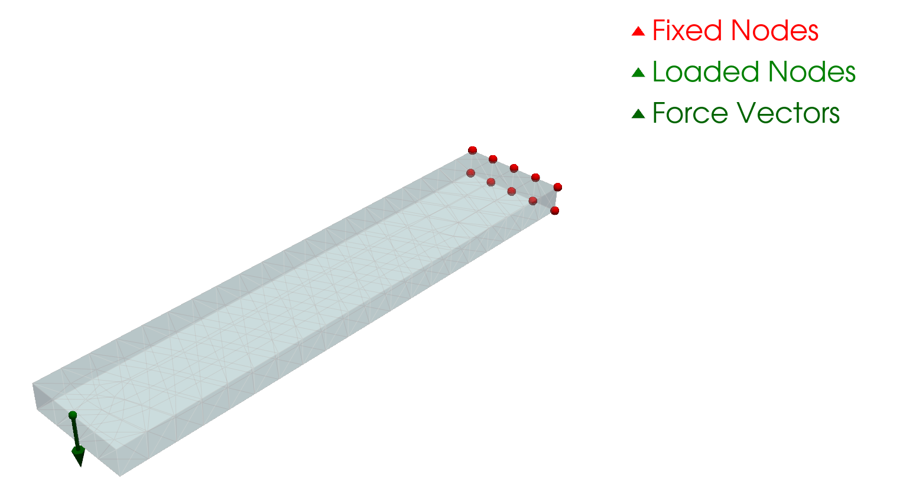

Loads apply forces to the model:

#### DistributedLoad

Force distributed evenly over a surface:

<PythonFunction
  name="DistributedLoad"
  signature="DistributedLoad"
  description="Apply a distributed load to a surface or volume."
  params={{
    location: { type: 'Union[str, Tuple[float, float, float]]', description: 'Surface identifier (`top`, `bottom`, `x_min`, `x_max`, etc.)' },
    force: { type: 'Union[float, Tuple[float, float, float]]', description: 'Magnitude of the load (scalar or vector)' },
    direction: { type: 'Optional[str]', description: 'Direction of the load ("x", "y", "z") if force is scalar', default: 'None' }
  }}
  returns="None"
  returnType="None"
/>

#### PointLoad

Concentrated force at a specific location:

```python
from rapidcadpy.fea import PointLoad, FixedConstraint, FEAAnalyzer

# Cantilever beam dimensions
LENGTH, WIDTH, HEIGHT = 100.0, 20.0, 5.0

# Create cantilever beam (not centered, starting from origin)
wp = app.work_plane("XY")
beam = wp.move_to(0, 0).rect(LENGTH, WIDTH, centered=False).extrude(HEIGHT)

# Point load at the free end (center of tip face)
load_point = (LENGTH - 1, WIDTH / 2, HEIGHT)
load = PointLoad(point=load_point, force=-1000.0, direction="z", tolerance=2.0)

# Fixed constraint at the base
constraint = FixedConstraint(location="x_min", dofs=[True, True, True])

# Run FEA
fea = FEAAnalyzer(
    beam,
    loads=[load],
    constraints=[constraint],
    material=Material.STEEL,
    kernel="torch-fem",
    mesh_size=5.0
)

# Visualize boundary conditions
fea.show()
```



<PythonFunction
  name="PointLoad"
  signature="PointLoad"
  description="Apply a concentrated load at a specific point."
  params={{
    point: { type: 'Tuple[float, float, float]', description: 'Coordinates of the point where the load is applied' },
    force: { type: 'Union[float, Tuple[float, float, float]]', description: 'Magnitude of the load (scalar or vector)' },
    direction: { type: 'Optional[str]', description: 'Direction of the load ("x", "y", "z") if force is scalar', default: 'None' },
    tolerance: { type: 'float', description: 'Tolerance for locating the point (mm)', default: 0.1 }
  }}
  returns="None"
  returnType="None"
  />

#### PressureLoad

Pressure applied to a surface:

```python
from rapidcadpy.fea import PressureLoad

PressureLoad(
    location='top',
    pressure=-10.0  # MPa (negative for compression)
)
```

### Location Identifiers

Boundary conditions support these location identifiers:

- `'x_min'` / `'end_1'` - Surface at minimum X
- `'x_max'` / `'end_2'` - Surface at maximum X
- `'y_min'` - Surface at minimum Y
- `'y_max'` - Surface at maximum Y
- `'z_min'` / `'bottom'` - Surface at minimum Z
- `'z_max'` / `'top'` - Surface at maximum Z
- `(x, y, z)` - Specific point coordinates