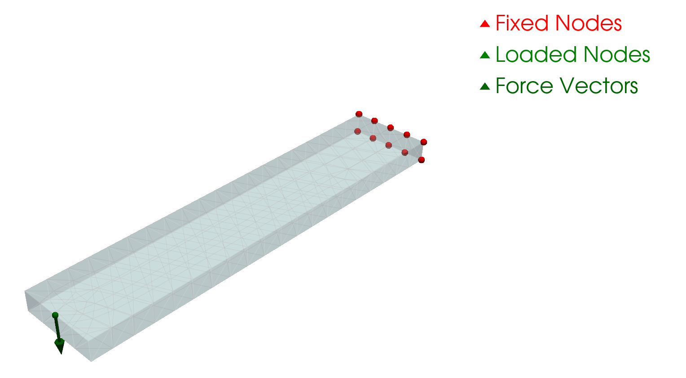

Loads apply forces to the model:

#### DistributedLoad

Force distributed evenly over a surface:

<PythonFunction
  name="DistributedLoad"
  signature="DistributedLoad"
  description="Apply a distributed load to a surface or volume."
  params={{
    location: { type: 'Union[str, Tuple[float, float, float], Dict[str, float]]', description: 'Surface identifier (`top`, `bottom`, `x_min`, `x_max`, etc.) or bounding box dict' },
    force: { type: 'Union[float, Tuple[float, float, float]]', description: 'Magnitude of the load (scalar or vector)' },
    direction: { type: 'Optional[str]', description: 'Direction of the load ("x", "y", "z", "normal") if force is scalar', default: 'None' },
    tolerance: { type: 'float', description: 'Distance tolerance for node selection (mm)', default: 1.0 }
  }}
  returns="None"
  returnType="None"
/>

#### PointLoad

Concentrated force at a specific location:

```python
from rapidcadpy.integrations.occ import OpenCascadeApp
from rapidcadpy.fea import PointLoad, FixedConstraint, FEAAnalyzer, Material, LoadCase

app = OpenCascadeApp()

# Cantilever beam dimensions
LENGTH, WIDTH, HEIGHT = 100.0, 20.0, 5.0

# Create cantilever beam (not centered, starting from origin)
wp = app.work_plane("XY")
beam = wp.move_to(0, 0).rect(LENGTH, WIDTH, centered=False).extrude(HEIGHT)

# Point load at the free end (center of tip face)
load_point = (LENGTH - 1, WIDTH / 2, HEIGHT)
load = PointLoad(point=load_point, force=-1000.0, direction="z", tolerance=2.0)

# Fixed constraint at the base
constraint = FixedConstraint(location="x_min", dofs=[True, True, True])

# Set up the load case
load_case = LoadCase(
    material=Material.STEEL,
    loads=[load],
    constraints=[constraint]
)

# Run FEA
fea = FEAAnalyzer(
    shape=beam,
    load_case=load_case,
    mesh_size=5.0,
    kernel="torch-fem"
)

# Visualize boundary conditions
fea.show()
```



<PythonFunction
  name="PointLoad"
  signature="PointLoad"
  description="Apply a concentrated load at a specific point."
  params={{
    point: { type: 'Tuple[float, float, float]', description: 'Coordinates of the point where the load is applied' },
    force: { type: 'Union[float, Tuple[float, float, float]]', description: 'Magnitude of the load (scalar or vector)' },
    direction: { type: 'Optional[str]', description: 'Direction of the load ("x", "y", "z") if force is scalar', default: 'None' },
    tolerance: { type: 'float', description: 'Distance tolerance for node selection (mm)', default: 1.0 },
    search_radius: { type: 'Optional[Tuple[float, float, float]]', description: 'Optional anisotropic search radii (rx, ry, rz) for ellipsoidal neighborhood', default: 'None' }
  }}
  returns="None"
  returnType="None"
  />

#### PressureLoad

Pressure applied to a surface:

```python
from rapidcadpy.fea import PressureLoad

PressureLoad(
    location='top',
    pressure=-10.0  # MPa (negative for compression)
)
```

### Location Guidance

Boundary conditions and point/distributed loads resolve their placement using the same helper logic as `LoadCase`, so you can mix named faces, explicit coordinates, or parser-generated selectors.

- **Named faces** – the familiar aliases work for both loads and constraints:
  - `'x_min'` / `'end_1'` (minimum X), `'x_max'` / `'end_2'` (maximum X)
  - `'y_min'`, `'y_max'`, `'z_min'` / `'bottom'`, `'z_max'` / `'top'`
- **Explicit points** – supply a tuple/list like `(x, y, z)` or a dictionary with `"x"`, `"y"`, and `"z"` keys to target a specific coordinate.
- **Bounding boxes** – pass a dictionary with `x_min`, `x_max`, `y_min`, `y_max`, `z_min`, and `z_max` to describe a volume (for example, when describing selector queries from imported Abaqus models).
- **Spatial selectors** – `LoadCase.from_inp()` builds selectors named `SELECTOR_<NSET_NAME>` whose `.query` can be reused. Provide the selector ID string (or objects carrying a `region_id`) and the loader will resolve the stored box/point data.

If a custom load or constraint exposes a `location` attribute, passes a `region_id`, or stores `point` data, the same resolver keeps the natural-language description and runtime placement in sync with the documented identifiers above.