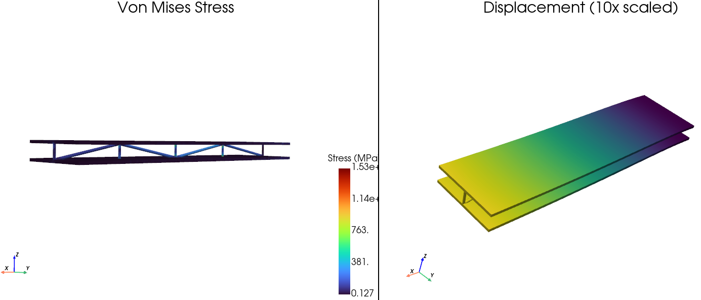

### Interactive Visualization

`results` is a `FEAResults` object returned by the `FEAAnalyzer.solve()` method. It provides an interactive 3D viewer to explore FEA results such as stress and displacement.

```python
# Display modes
results.show(display='stress')          # Von Mises stress
results.show(display='displacement')    # Deformation (scaled)
results.show(display='both')            # Side-by-side (default)
results.show(display='conditions')      # Boundary conditions

# Customize
results.show(
    display='displacement',
    displacement_scale=10.0,   # Exaggerate deformation
    window_size=(1920, 1080)   # Custom window size
)
```



### Boundary Condition Visualization

The `FEAAnalyzer` can visualize constraints and loads before solving using the analyzer's `show()` method:

```python
# After setting up boundary conditions
analyzer.add_constraint(FixedConstraint("x_min"))
analyzer.add_load(DistributedLoad("top", force=-1000.0))

# Preview the setup
analyzer.show()
```

Shows:
- 🔴 **Red spheres** - Fixed/constrained nodes
- 🟢 **Green spheres** - Loaded nodes
- ➡️ **Green arrows** - Force direction and magnitude

